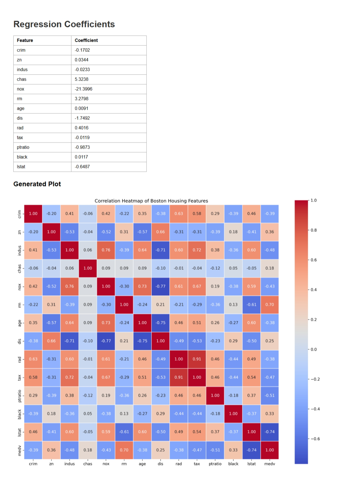

1. Navigate to the directory where the main.py file is located.
2. Enter `uvicorn main:app --reload` in the terminal.
3. Click on the address uvicorn is running on.

## Endpoints
There are 3 separate POST endpoints for

1. uploading the csv file  
`@app.post("/upload/")`

2. train the model on the data  
`@app.post("/train/")`

3. make predictions on unseen data  
`@app.post("/predict/")`

I have also added a rate limiter that limits the number of processing requests, currently set at 2 requests per minute.  
`@limiter.limit("2/minute")`

## Homepage
FastAPI serves a plain HTML page, to upload the Boston.csv file, then select a visualization type. Clicking on submit redirects to another page with the visualization. The visualization is saved to disk in static folder with a date and timestamp.

## Visualization page
This page contains a table of some regression coefficients along with the corresponding visualization. This example shows a heatmap.

## Histogram
This example shows a histogram of medv values.
